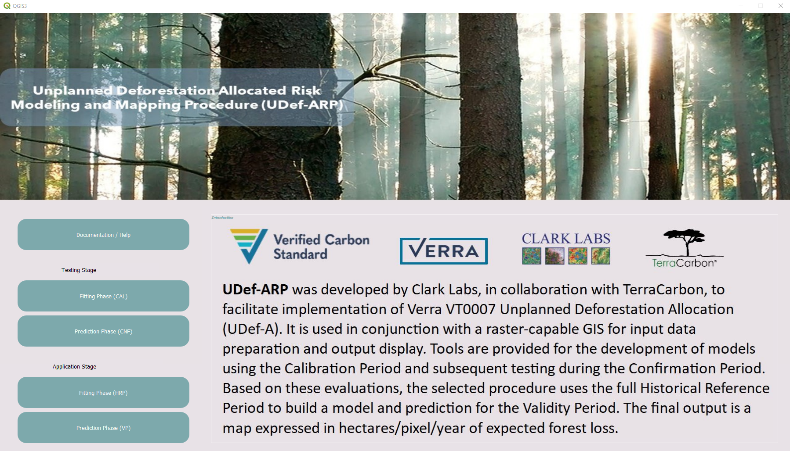

# Unplanned Deforestation Allocated Risk Modeling and Mapping Procedure (UDef-ARP) Plugin for QGIS

UDef-ARP was developed by Clark Labs, in collaboration with TerraCarbon, to facilitate implementation of the Verra tool, VT0007 Unplanned Deforestation Allocation (UDef-A). It is used in conjunction with a raster-capable GIS for input data preparation and output display. Tools are provided for the development of models using the Calibration Period (CAL) and subsequent testing during the Confirmation Period (CNF). Based on these evaluations, the selected procedure uses the full Historical Reference Period (HRP) to build a model and prediction for the Validity Period (VP). The final output is a map expressed in hectares/pixel/year of expected forest loss.

UDef-ARP provides the basis for developing a benchmark model as well as tools for comparative testing against alternative empirical models. The benchmark is intentionally simple – it requires only two inputs, distance from the forest edge (non-forest) and a map of administrative divisions that are fully nested within the jurisdiction. Based on these, it uses a relative frequency approach to determine the density of expected deforestation. In testing, this was found to provide a strong benchmark. However, it is intended that users incorporate more sophisticated empirical models, which may be used in UDef-A if they can be shown to be superior to the benchmark for both the fitted model in the Calibration Period and the prediction model in the Confirmation Period. Note that the manner in which alternative models are incorporated and tested is very specifically defined by the UDef-A protocol. UDef-ARP facilitates this testing process.

#### Some important points:
1. At present, UDef-ARP only supports Windows platforms.
2. At present, only limited bulletproofing has been done. Please read the UDef-A document carefully regarding required inputs.
3. UDef-ARP is still under development. Frequent updates are expected.

## Requirements
### Operating System
The UDef-ARP is currently operational exclusively on Windows systems.

### Dependencies
- [Python](https://www.python.org/) 3.9+
- [GDAL](https://github.com/OSGeo/gdal) 3.7.2+
- [PyQt5](https://pypi.org/project/PyQt5/)
- [NumPy](https://github.com/numpy/numpy)
- [pandas](https://github.com/pandas-dev/pandas)
- [GeoPandas](https://github.com/geopandas/geopandas)
- [SciPy](https://github.com/scipy/scipy)
- [Shapely](https://github.com/shapely/shapely)
- [Matplotlib](https://github.com/matplotlib/matplotlib)
- [Seaborn](https://github.com/mwaskom/seaborn)

### Hardward Requirements
UDef-ARP was created with open source tools. In the current version, all raster inputs are stored in RAM during processing. Therefore, large jurisdictions will require substantial RAM allocations (e.g., 64Gb). The interface was developed in Qt 5. A minimum screen resolution of 1920 x 1080 (HD) is required. A 4K resolution is recommended.

## Environment Setup

### Step 1: Download QGIS
Download and install the latest version of QGIS from https://www.qgis.org/en/site/forusers/download.html

### Step 2: Install plugin dependencies (if needed)
Open the OSGeo Shell. Use the following command to check what packages are already installed into QGIS:

```
python -m pip list
```
Use the following command and a package name to install packages to your QGIS python environment:
```
pip install package_name
```
## Before You Start
### Step 1: Open QGIS
Open the QGIS GUI.

### Step 2: Install Plugin
A. Use the Plugin Manager to install the plugin

OR

B. Copy repository directly to plugins folder

### Step 3: Prepare Your Data
UDef-ARP accepts raster map data is either a Geotiff “.tif” or TerrSet “.rst” (binary flat raster ) format. Similarly, outputs can be in either format. All map data are required to be on an equal area projection. All map inputs must be co-registered and have the same resolution and the same number of rows and columns.

<p align="center">
  
</p>

## COPYRIGHT AND LICENSE
©2023-2024 Clark Labs. This software is free to use and distribute under the terms of the GNU-GLP license.
